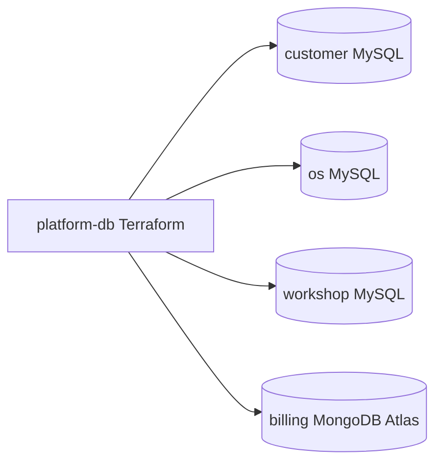

# Platform Database Infrastructure

Terraform repository for the managed databases used by the Phase 4
microservices.

## Responsibility

- Amazon RDS MySQL for `customer-service`
- Amazon RDS MySQL for `os-service`
- Amazon RDS MySQL for `workshop-service`
- MongoDB Atlas for `billing-service`
- remote-backend-compatible Terraform workflow

This repository does not run migrations and does not deploy application code.

## Technology

- Terraform
- AWS RDS
- AWS Secrets Manager
- MongoDB Atlas
- GitHub Actions CI/CD

## Architecture



## Data Ownership

- `customer-service` must use only its own MySQL database
- `os-service` must use only its own MySQL database
- `workshop-service` must use only its own MySQL database
- `billing-service` must use only its own MongoDB database

Cross-service database access is not allowed.

## Prerequisites

- Terraform
- AWS credentials with permissions for the declared resources
- MongoDB Atlas API credentials
- reviewed backend configuration before any non-local apply

## Local Validation

```bash
terraform fmt -check -recursive
terraform init -backend=false
terraform validate
```

`terraform plan` and `terraform apply` depend on reviewed environment variables,
backend configuration and credentials. They are intentionally not executed from
this workspace.

## CI/CD

Workflow files:

- `.github/workflows/ci.yml`
- `.github/workflows/cd.yml`

CI validates:

- `terraform fmt -check -recursive`
- `terraform init -backend=false`
- `terraform validate`

CD is configured for:

- `homologation` -> GitHub Environment `homologation`
- `main` -> GitHub Environment `production`

The hosted workflow is expected to run `terraform init`, `terraform plan` and
`terraform apply` only with reviewed environment configuration. Production
approval remains a GitHub Environment responsibility.

## Costs And Safety

- RDS and Atlas generate real cost while provisioned
- remote apply must be reviewed before execution
- no apply should be run without backend, credentials and cost review

## Delivery Evidence

- repository URL: `PENDING`
- homologation URL: `PENDING`
- latest successful CI run: `PENDING`
- quality gate: `PENDING`
- coverage evidence: `PENDING (Terraform repository without local coverage artifact)`
- branch protection: `PENDING VERIFICATION`

## External Evidence Status

- hosted repository URL: `PENDING`
- remote backend and environment protections: `PENDING VERIFICATION`
- no `terraform apply` was executed from this workspace
