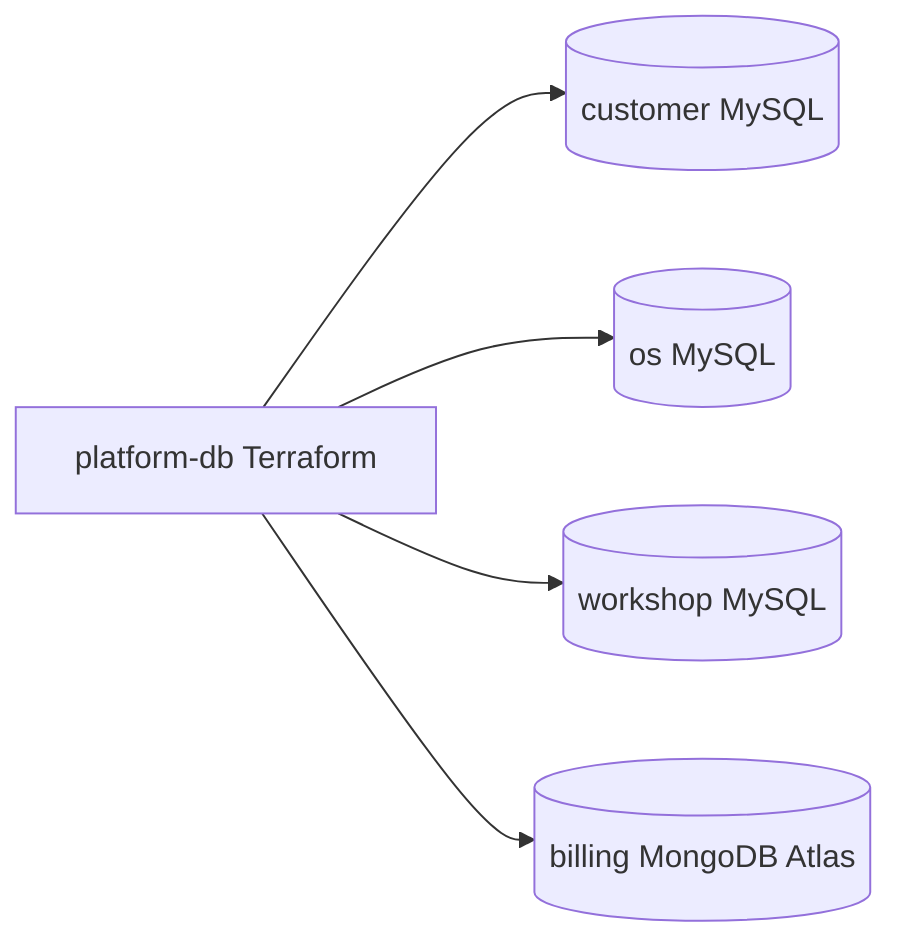

# Platform Database Infrastructure

Terraform repository for the managed databases used by the Phase 4
microservices.

## Responsibility

- Amazon RDS MySQL for `customer-service`
- Amazon RDS MySQL for `os-service`
- Amazon RDS MySQL for `workshop-service`
- MongoDB Atlas for `billing-service`
- remote-backend-compatible Terraform workflow

This repository does not run migrations and does not deploy application code.
It now includes a separate bootstrap layer that creates the remote backend
resources required by the main Terraform stack.
It also includes a separate foundation layer that provisions the shared VPC and
subnets consumed by the managed database stack.

## Technology

- Terraform
- AWS RDS
- AWS Secrets Manager
- MongoDB Atlas
- GitHub Actions CI/CD

## Architecture



## Data Ownership

- `customer-service` must use only its own MySQL database
- `os-service` must use only its own MySQL database
- `workshop-service` must use only its own MySQL database
- `billing-service` must use only its own MongoDB database

Cross-service database access is not allowed.

## Prerequisites

- Terraform
- AWS credentials with permissions for the declared resources
- MongoDB Atlas API credentials
- reviewed backend configuration before any non-local apply

## Execution Order

Apply the layers in this order:

1. `bootstrap/`
2. `foundation/`
3. repository root

The root module keeps `backend "s3" {}` and expects the backend identifiers to
exist before `terraform init` runs against the root module.

Run the isolated bootstrap layer first. It uses local state by default and
creates only:

- one S3 bucket for Terraform state
- one DynamoDB table for Terraform state locking

Example flow:

```bash
cd bootstrap
cp terraform.tfvars.example terraform.tfvars
terraform init
terraform apply
terraform output
```

Use the bootstrap outputs to configure the main stack backend values:

- `TF_BACKEND_BUCKET`: `terraform_state_bucket_name`
- `TF_BACKEND_DYNAMODB_TABLE`: `terraform_state_lock_table_name`
- `TF_BACKEND_KEY_PREFIX`: `terraform_state_key_prefix`
- backend region: `terraform_state_region`

Example:

```bash
terraform init \
  -backend-config="bucket=${TF_BACKEND_BUCKET}" \
  -backend-config="key=${TF_BACKEND_KEY_PREFIX}/terraform.tfstate" \
  -backend-config="region=${AWS_REGION}" \
  -backend-config="dynamodb_table=${TF_BACKEND_DYNAMODB_TABLE}"
```

The bootstrap layer is intentionally isolated under
`platform-db/bootstrap/` to avoid self-referential backend bootstrapping.

Run the shared AWS foundation second. It uses the bootstrap-created backend and
creates only:

- one VPC
- two public subnets
- two private subnets for the database stack
- one internet gateway
- public and private route tables

Example flow:

```bash
cd foundation
cp terraform.tfvars.example terraform.tfvars
terraform init \
  -backend-config="bucket=${TF_BACKEND_BUCKET}" \
  -backend-config="key=${TF_BACKEND_KEY_PREFIX}/foundation/${TF_VAR_environment}.tfstate" \
  -backend-config="region=${AWS_REGION}" \
  -backend-config="dynamodb_table=${TF_BACKEND_DYNAMODB_TABLE}"
terraform apply
terraform output
```

Use the foundation outputs to configure the main database stack automatically
through remote state:

- `TF_VAR_foundation_state_bucket`: same value as `TF_BACKEND_BUCKET`
- `TF_VAR_foundation_state_key`: `foundation/<environment>.tfstate` under the backend prefix
- `TF_VAR_foundation_state_region`: same value as `AWS_REGION`

Example:

```bash
export TF_VAR_foundation_state_bucket="${TF_BACKEND_BUCKET}"
export TF_VAR_foundation_state_key="${TF_BACKEND_KEY_PREFIX}/foundation/${TF_VAR_environment}.tfstate"
export TF_VAR_foundation_state_region="${AWS_REGION}"

terraform init \
  -backend-config="bucket=${TF_BACKEND_BUCKET}" \
  -backend-config="key=${TF_BACKEND_KEY_PREFIX}/${TF_VAR_environment}.tfstate" \
  -backend-config="region=${AWS_REGION}" \
  -backend-config="dynamodb_table=${TF_BACKEND_DYNAMODB_TABLE}"
terraform plan
```

Manual `vpc_id` and `private_subnet_ids` remain available only as a fallback
when the foundation state is not available yet.

## GitHub Environment Wiring

Current pipeline inputs are expected to be wired from Terraform outputs and
reviewed secrets as follows:

- `TF_BACKEND_BUCKET`: from `bootstrap` output `terraform_state_bucket_name`
- `TF_BACKEND_DYNAMODB_TABLE`: from `bootstrap` output `terraform_state_lock_table_name`
- `TF_BACKEND_KEY_PREFIX`: from `bootstrap` output `terraform_state_key_prefix`
- `AWS_REGION`: from `bootstrap` output `terraform_state_region`
- `TF_VAR_foundation_state_bucket`: derived in workflow from `TF_BACKEND_BUCKET`
- `TF_VAR_foundation_state_key`: derived in workflow from `TF_BACKEND_KEY_PREFIX` and environment
- `TF_VAR_foundation_state_region`: derived in workflow from `AWS_REGION`

Manual network identifiers were removed from the hosted workflow path:

- `TF_VAR_vpc_id`: no longer required when `foundation` state is available
- `TF_VAR_private_subnet_ids`: no longer required when `foundation` state is available

Manual hosted inputs that intentionally remain:

- AWS credentials
- MongoDB Atlas credentials
- MySQL and MongoDB service passwords
- `TF_VAR_allowed_mysql_cidr_blocks`
- MongoDB Atlas project and cluster configuration
- optional tags and project/environment naming variables

## Local Validation

```bash
terraform fmt -check -recursive
terraform init -backend=false
terraform validate
```

`terraform plan` and `terraform apply` depend on reviewed environment variables,
backend configuration and credentials. They are intentionally not executed from
this workspace.

Bootstrap layer local validation:

```bash
cd bootstrap
terraform fmt -check
terraform init
terraform validate
```

Foundation layer local validation:

```bash
cd foundation
terraform fmt -check
terraform init -backend=false
terraform validate
```

## CI/CD

Workflow files:

- `.github/workflows/ci.yml`
- `.github/workflows/cd.yml`

CI validates:

- `terraform fmt -check -recursive`
- `terraform -chdir=bootstrap init`
- `terraform -chdir=bootstrap validate`
- `terraform -chdir=foundation init -backend=false`
- `terraform -chdir=foundation validate`
- `terraform init -backend=false`
- `terraform validate`

CD is configured for:

- `homologation` -> GitHub Environment `homologation`
- `main` -> GitHub Environment `production`

The hosted workflow is expected to run `terraform init`, `terraform plan` and
`terraform apply` only with reviewed environment configuration. Production
approval remains a GitHub Environment responsibility.

## Costs And Safety

- RDS and Atlas generate real cost while provisioned
- remote apply must be reviewed before execution
- no apply should be run without backend, credentials and cost review
- bootstrap creates backend resources only; it does not provision VPC, EKS,
  Lambda or application infrastructure
- foundation creates only shared networking primitives; it does not provision
  EKS, Lambda or application infrastructure

## Delivery Evidence

- repository URL: `PENDING`
- homologation URL: `PENDING`
- latest successful CI run: `PENDING`
- quality gate: `PENDING`
- coverage evidence: `PENDING (Terraform repository without local coverage artifact)`
- branch protection: `PENDING VERIFICATION`

## External Evidence Status

- hosted repository URL: `PENDING`
- remote backend and environment protections: `PENDING VERIFICATION`
- no `terraform apply` was executed from this workspace
